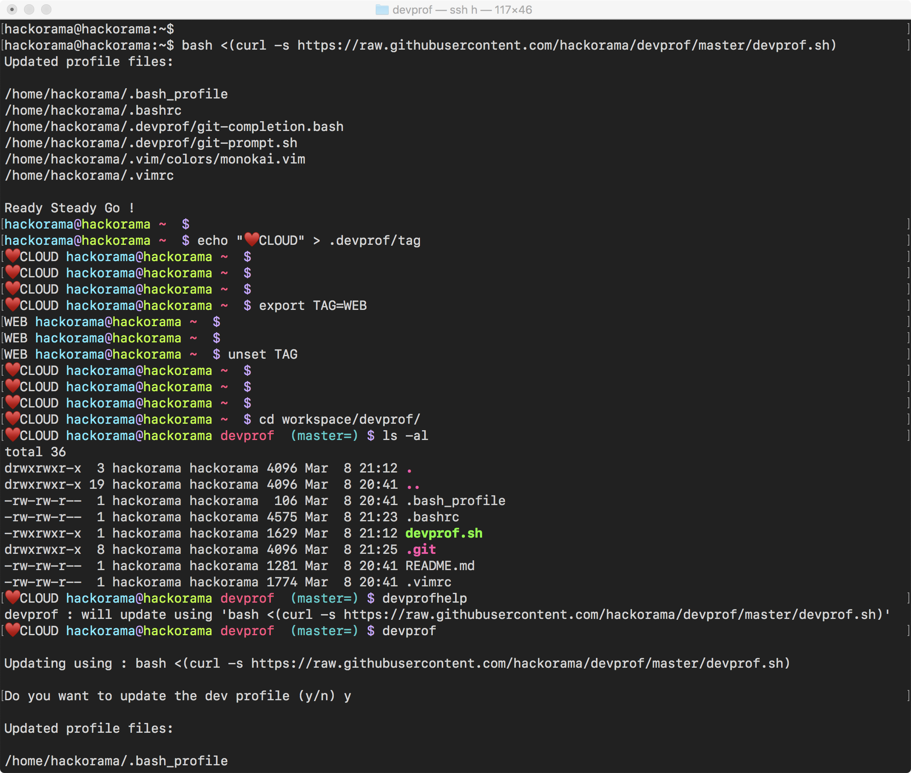

# Dev Profile

Development profile for bash, vim, git



## Install

> bash <(curl -s https://raw.githubusercontent.com/hackorama/devprof/master/devprof.sh)

```
$ bash <(curl -s https://raw.githubusercontent.com/hackorama/devprof/master/devprof.sh)
Updated profile files:

/Users/hackorama/.bash_profile
/Users/hackorama/.bashrc
/Users/hackorama/.devprof/git-completion.bash
/Users/hackorama/.devprof/git-prompt.sh
/Users/hackorama/.vim/colors/monokai.vim
/Users/hackorama/.vimrc

Ready Steady Go !
$
```

## Help

```
$ devprofhelp
devprof : will update using 'bash <(curl -s https://raw.githubusercontent.com/hackorama/devprof/master/devprof.sh)'

```

## Update

```
$ devprof

Updating using : bash <(curl -s https://raw.githubusercontent.com/hackorama/devprof/master/devprof.sh)

Do you want to update the dev profile (y/n) y

Updated profile files:

/Users/hackorama/.bash_profile
/Users/hackorama/.bashrc
/Users/hackorama/.devprof/git-completion.bash
/Users/hackorama/.devprof/git-prompt.sh
/Users/hackorama/.devprof/tag
/Users/hackorama/.vim/colors/monokai.vim
/Users/hackorama/.vimrc

Backed up existing profile files:

/Users/hackorama/.bash_profile.2019-03-08-20:21:19.bak
/Users/hackorama/.bashrc.2019-03-08-20:21:19.bak
/Users/hackorama/.vimrc.2019-03-08-20:21:20.bak

Ready Steady Go !
$
```

## Features

### Prompt

Set a tag on prompt to identify your servers by nick name

```
hackorama@cloud ~  $
hackorama@cloud ~  $ echo "GATEWAY" > ~/.devprof/tag
GATEWAY hackorama@cloud ~  $
GATEWAY hackorama@cloud ~  $
```

Set a temporary tag on prompt

```
GATEWAY hackorama@cloud ~  $
GATEWAY hackorama@cloud ~  $ export TAG="STAGING GATEWAY"
STAGING GATEWAY hackorama@cloud ~  $
STAGING GATEWAY hackorama@cloud ~  $
STAGING GATEWAY hackorama@cloud ~  $ unset TAG
GATEWAY hackorama@cloud ~  $
GATEWAY hackorama@cloud ~  $
```

> Can use color escape sequence and unicode symbols or emojis for the tag
>
> $ export TAG="\e[34m▶\e[0m BIONIC"
>
> $ echo "\e[31mRED\e[0m ROCK" >  ~/.devprof/tag

### Git

- Git command completion
- Git status on prompt

```
DEV hackorama@hackorama devprof  (master =) $ vi README.md
DEV hackorama@hackorama devprof  (master *=) $
```

### Vim

Colors, Syntax and Status Line


